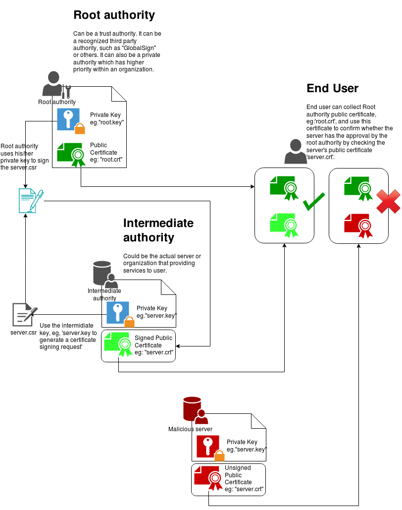

# Open SSL certificate authority

**Statement**: This is just a study notes in order to understand the Open SSL and some relating concepts. A lot of contents in this artical are copied from [Jamie Nguyen](https://jamielinux.com/)'s blog [OpenSSL Certificate Authority](https://jamielinux.com/docs/openssl-certificate-authority/index.html#)

## Artical summary(without Certificate revocation lists)
The following graph summarizes the relationship between different keys and certificates.

## Certificate authority

> A certificate authority (CA) is an entity that signs digital certificates. Manywebsites need to let their customers know that the connection is secure, so they pay an internationally trusted CA (eg, VeriSign, DigiCert) to sign a certificatefor their domain.
>
> In some cases it may make more sense to act as your own CA, rather than paying a CA like DigiCert. Common cases include securing an intranet website, or for issuing certificates to clients to allow them to authenticate to a server (eg, Apache, OpenVPN).

### CA-ROOT-keypair

- root key (ca.key.pem)[**private**]
- root certificate (ca.csrt.pem)[**Public**]

> Typically, the root CA does not sign server or client certificates directly. The
> root CA is only ever used to create one or more intermediate CAs, which are
> trusted by the root CA to sign certificates on their behalf. 

root key can be used to create a root certificate. 

>Use the root key (`ca.key.pem`) to create a root certificate (`ca.cert.pem`).
>Give the root certificate a long expiry date, such as twenty years. Once the
>root certificate expires, all certificates signed by the CA become invalid.

### Intermediate CA

>An intermediate certificate authority (CA) is an entity that can signcertificates on behalf of the root CA. The root CA signs the intermediatecertificate, forming a chain of trust.
>
>The purpose of using an intermediate CA is primarily for security. The root keycan be kept offline and used as infrequently as possible. If the intermediatekey is compromised, the root CA can revoke the intermediate certificate andcreate a new intermediate cryptographic pair.

- Create an intermediate key [**private**]

- use the intermediate key to create a certificate signing request (CSR)

- Create the intermediate certificate(*cert, crt*) (using the **root key?**)

  - Input: .csr
  - output: .crt(.cert)

- Create the certification chain file

  - >When an application (eg, a web browser) tries to verify a certificate signed bythe intermediate CA, it must also verify the intermediate certificate againstthe root certificate. To complete the chain of trust, create a CA certificatechain to present to the application.
    >
    >To create the CA certificate chain, concatenate the intermediate and rootcertificates together. We will use this file later to verify certificates signedby the intermediate CA.

### Sign server and client using intermediate CA

>We will be signing certificates using our intermediate CA. You can use these
>signed certificates in a variety of situations, such as to secure connections to
>a web server or to authenticate clients connecting to a service.

- Create private key for server and client

  - > Our root and intermediate pairs are 4096 bits. Server and client certificates
    > normally expire after one year, so we can safely use 2048 bits instead.
    >

- Use the private key to create a certificate signing request (CSR)

  - > The CSR details don’t need to match the intermediate CA. For server certificates, the
    > **Common Name** must be a fully qualified domain name (eg, `www.example.com`),
    > whereas for client certificates it can be any unique identifier (eg, an e-mail
    > address). Note that the **Common Name** cannot be the same as either your root
    > or intermediate certificate.

- Sign the .csr file

  - > To create a certificate, use the intermediate CA to sign the CSR. If the
    > certificate is going to be used on a server, use the `server_cert` extension.
    > If the certificate is going to be used for user authentication, use the
    > `usr_cert` extension. Certificates are usually given a validity of one year,
    > though a CA will typically give a few days extra for convenience.

- Deploy the certificate

  - > You can now either deploy your new certificate to a server, or distribute thecertificate to a client. When deploying to a server application (eg, Apache),you need to make the following files available:
    >
    > - `ca-chain.cert.pem`
    > - `www.example.com.key.pem`
    > - `www.example.com.cert.pem`
    >
    > If you’re signing a CSR from a third-party, you don’t have access to theirprivate key so you only need to give them back the chain file(`ca-chain.cert.pem`) and the certificate (`www.example.com.cert.pem`)

### Certificate revocation list (CRL)

> A certificate revocation list (CRL) provides a list of certificates that have
> been revoked. A client application, such as a web browser, can use a CRL to
> check a server’s authenticity. A server application, such as Apache or OpenVPN,
> can use a CRL to deny access to clients that are no longer trusted.

I will stop here just because I do not need this bit for now. Will come back later if needed. 